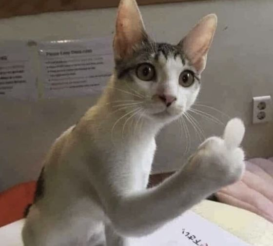
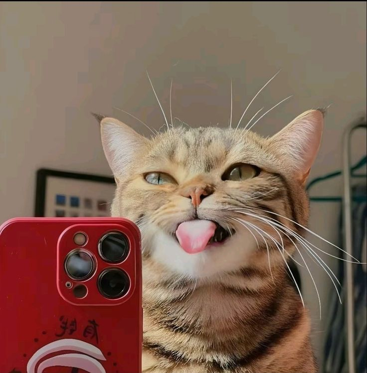
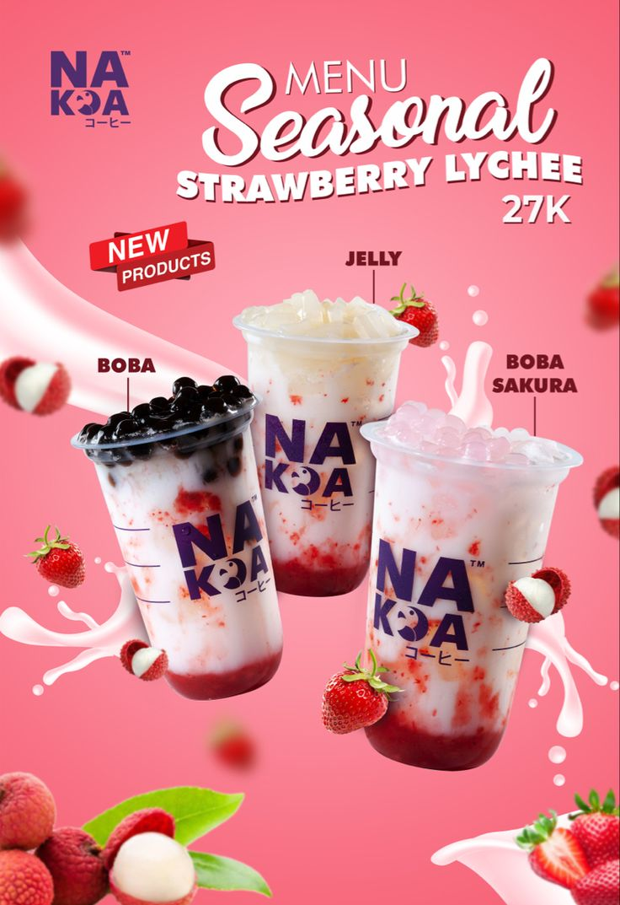
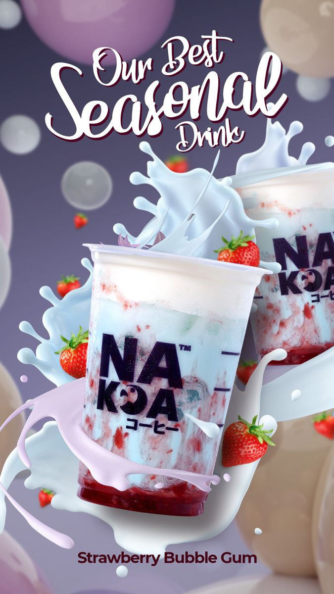
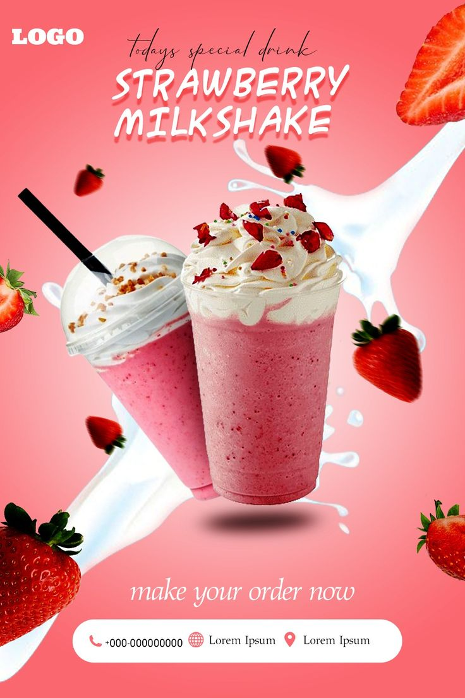

<!DOCTYPE html>
<html lang="en">
<head>
    <meta charset="UTF-8">
    <meta http-equiv="X-UA-Compatible" content="IE=edge">
    <meta name="viewport" content="width=device-width, initial-scale=1.0">
    <link rel="stylesheet" href="Style.css">
    <link rel="stylesheet" href="css/all.css">
    <title>my profile</title>
    <link rel="stylesheet" href="https://unpkg.com/aos@next/dist/aos.css"/>
</head>
<body onload="loader()">
    

     <!-----start Hearder section----->
     

        

            <nav >
                
                <ul id="sidmenu" data-aos="zoom-in">
                    <li><a href="#hearder" >Home</a></li>
                    <li><a href="#about" >Tentang</a></li>
                    <li><a href="#portfolio" >Proses Desain</a></li>
                    <li><a href="#produk">Produk</a></li>
                    <li><a href="#contact">Kontak</a></li>
                    <i class="fa-solid fa-xmark" onclick="closemenu()"></i>
                 </ul>
                 <i class="fa-solid fa-bars" onclick="openmenu()"></i>
              </nav> 
              

                
Please Wellcome

                <h5>To Manula</h5>
                <h1>"MANULA"manusia pelupa & pemula   Kelompok 4</h1>
              
       
            

        

     

      <!-----End Hearder section----->
     
      <!-----start About section----->
      

        

            

                

                    
                

                

                    <h1 class="sub-title">Tentang MANULA</h1>
                    
"manula merupakan manusia pelupa dan pemula"

mungkin berasal dari sudut pandang yang melihat bahwa manula (manusia lanjut usia)

sering mengalami beberapa perubahan dalam kemampuan kognitif,

terutama terkait memori atau daya ingat.

Mereka juga memiliki kemampuan dan wawasan yang sangat berharga

dan sering menjadi pembimbing bagi generasi yang lebih muda.

                   

                    
Skills

                    
Experience

                    
Education

                   

                   

                    <ul>
                        <li>Komunikasi dan Empati Lansia sering memiliki keterampilan komunikasi yang baik dan empati tinggi.</li>

                        <li>Keterampilan Teknis dan Manual Banyak manula yang menguasai keterampilan praktis, seperti kerajinan, pertukangan,
memasak, atau berkebun, yang memerlukan ketelitian dan kesabaran.</li>

                        <li>Kemampuan Mengelola Konflik Pengalaman hidup sering membuat manula lebih sabar dan bijak dalam menyelesaikan
konflik, baik dalam kehidupan pribadi maupun profesional.</li>

                        <li>Keterampilan Konsultatif atau Pembimbingan Banyak manula memiliki pengalaman sebagai mentor atau pembimbing.</li>

                   

                   

                    <ul>
                        <li>Pengalaman Karier dan Kehidupan Pengalaman hidup mereka yang luas mencakup berbagai bidang,mulai dari karier,keluarga.</li>
                        <li>Pengambilan Keputusan Melalui berbagai pengalaman hidup, manula cenderung lebih matang.</li>
                        <li>Pengetahuan Budaya dan Tradisi Manula sering memiliki pengetahuan mendalam tentang budaya,sejarah,tradisi.</li>
                    </ul>
                   

                   

                    <ul>
                        <li>Pendidikan Formal dan Non-Formal Banyak manula memiliki latar belakang pendidikan yang baik.</li>
                        <li>Kesediaan untuk Terus Belajar Meskipun mungkin lebih lambat dalam mengadopsi teknologi baru.</li>
                        <li>Penguasaan Nilai dan Etika Pendidikan yang mereka peroleh tentang etika, moral, dan tata krama.</li>
                    </ul>
                   

                

            

        

      

      <!-----End About section----->

        <!----portfolio section Start ----->

        

            

                <h1 class="sub-title">PROSES DESAIN</h1>
                
Proses desain adalah fondasi yang menjadi dasar setiap produk.

                

                    

                        
                        

                            <h3>kucing</h3>
                            
KUCING LUCU DAN MENGGEMASKAN

                            <a target="_blank"  href="https://www.tiktok.com/@chloenfreya/video/7435280128327896327"><i class="fa-solid fa-up-right-from-square"></i></a>
                        

                        
                    

                    

                        
                        

                            <h3>kucing</h3>
                            
KUCING LUCU DAN MENGGEMASKAN

                            <a target="_blank"  href="https://www.tiktok.com/@chloenfreya/video/7435280128327896327"><i class="fa-solid fa-up-right-from-square"></i></a>
                        

                        
                    

                    

                        
                        

                            <h3>kucing</h3>
                            
KUCING LUCU DAN MENGGEMASKAN

                            <a target="_blank"  href="https://www.tiktok.com/@chloenfreya/video/7435280128327896327"><i class="fa-solid fa-up-right-from-square"></i></a>
                    
         
                
                
            

        

        

            

                

                    

                        
                        

                            <h3>kucing</h3>
                            
KUCING LUCU DAN MENGGEMASKAN

                            <a target="_blank"  href="https://www.tiktok.com/@chloenfreya/video/7435280128327896327"><i class="fa-solid fa-up-right-from-square"></i></a>
                        

                        
                    

                    

                        
                        

                            <h3>kucing</h3>
                            
KUCING LUCU DAN MENGGEMASKAN

                            <a target="_blank"  href="https://www.tiktok.com/@chloenfreya/video/7435280128327896327"><i class="fa-solid fa-up-right-from-square"></i></a>
                        

                        
                    

                    

                        
                        

                            <h3>kucing</h3>
                            
KUCING LUCU DAN MENGGEMASKAN

                            <a target="_blank"  href="https://www.tiktok.com/@chloenfreya/video/7435280128327896327"><i class="fa-solid fa-up-right-from-square"></i></a>
                        
             
                    
                   
                

                <a href="https://www.tiktok.com/@chloenfreya/video/7435280128327896327" class="btn">Random Aja</a>
            

        

         <!----portfolio section End ----->
       
         

            

                <h1 class="sub-title">PRODUK</h1>
                
Usaha kreatif akan mengungkap bakat dan komitmen seseorang.

                

                    

                        
                        

                            <h3>MINUMAN</h3>
                            
Seger dan enak banget pokoknya

                            <a target="_blank"  href="https://www.tiktok.com/@chloenfreya/video/7435280128327896327"><i class="fa-solid fa-up-right-from-square"></i></a>
                        

                        
                    

                    

                        
                        

                            <h3>MINUMAN</h3>
                            
Seger dan enak banget pokoknya

                            <a target="_blank"  href="https://www.tiktok.com/@chloenfreya/video/7435280128327896327"><i class="fa-solid fa-up-right-from-square"></i></a>
                        

                        
                    

                    

                        
                        

                            <h3>MINUMAN</h3>
                            
Seger dan enak banget pokoknya

                            <a target="_blank"  href="https://www.tiktok.com/@chloenfreya/video/7435280128327896327"><i class="fa-solid fa-up-right-from-square"></i></a>
                        
             
                    
                   
                

                <a href="https://www.tiktok.com/@chloenfreya/video/7435280128327896327" class="btn">Random Aja</a>

            

        

         
          <!----Contact section Start ----->
          

            

                

                    

                        <h1 class="sub-title">Kontak Kami</h1>
                        
<i class="fa-solid fa-paper-plane"></i>MANULA@gmail.com

                        
<i class="fa-solid fa-square-phone-flip"></i>08888888889*

                        

            
                            <a target="_blank" class="instagram" href="https://www.instagram.com/shanazalf/"><i class="fa-brands fa-square-instagram"></i></a>
                            <a target="_blank" class="tiktok" href="https://www.tiktok.com/@chloenfreya/video/7435280128327896327"><i class="fa-brands fa-tiktok"></i></a>
                            <a target="_blank" class="github" href="https://github.com/zannopz?tab=repositories"><i class="fa-brands fa-github"></i></a>
                            <a target="_blank" class="linkedin" href=""><i class="fa-brands fa-linkedin"></i></a>
                        

                        <a href="" class="btn btn2">Lihat Resume</a>

                    

                    

                        <form >
                            <input type="text" name="Name" placeholder="Nama" required>
                            <input type="Email" name="Email" placeholder="Gmail" required>
                            <textarea name="massage" rows="6" placeholder="Pesan"></textarea>
                            <button type="submit" class="btn btn2">Kirim</button>
                        </form>
                    

                

            

            

                
Copyright@ KELOMPOK 4 <i class="fa-solid fa-heart"></i> TUGAS website PROJECT kelompok kami

                
💓THANK YOU AND NAMA KELOMPOK KAMI🌻

            

          

          <!----Contact section End ----->
          

      
    
    <!-- aos data  -->
      
      
    
     <body bgcolor="white" text="black" oncontextmenu="return false;" onkeydown="return false;" onmousedown="return false;" onclick="document.getElementById('lagu').play();fs()" id="body" onload="typeWriter()">
    <audio src="Lagu.mp3" Autoplay="true" id="lagu"></audio>
    </body>

<video
    id="background-video"
    src="Wallpaper13.jpg"
    autoplay=""
    loop=""
    muted=""
    style="position: fixed; object-fit: cover"
    poster="data:image/png;base64, iVBORw0KGgoAAAANSUhEUgAAAAEAAAABCAQAAAC1HAwCAAAAC0lEQVR42mNk+A8AAQUBAScY42YAAAAASUVORK5CYII=">
<source src="dragon.mp4" type="video/mp4" />
</video>
<table width="100%" height="90%">
    <td>
            
    </td>
</table>
</body>
</html>
<marquee>
    
    <b>Project Kelompok Kami</b> <h0 style="color: #fff;"> 🍻•MANULA | manusia pelupa dan pemula | MANULA | manusia pelupa dan pemula | MANULA | manusia pelupa dan pemula | MANULA | manusia pelupa dan pemula | MANULA | manusia pelupa dan pemula•🍻
        <b>Portfolio By Me</b> <h0 style="color: #fff;"> 🍻•MANULA | manusia pelupa dan pemula | MANULA | manusia pelupa dan pemula | MANULA | manusia pelupa dan pemula | MANULA | manusia pelupa dan pemula | MANULA | manusia pelupa dan pemula•🍻
    
  </marquee>
  <body bgcolor="Black" text="white" oncontextmenu="return false;" onkeydown="return false;" onmousedown="return false;" onclick="document.getElementById('lagu').play();fs()" id="body" onload="typeWriter()">
<audio src="Lagu.mp3" Autoplay="true" id="lagu"></audio>

     <iframe loading="lazy" style="position: absolute; width: 100%; height: 100%; top: 0; left: 0; border: none; padding: 0;margin: 0;"
       src="https://www.canva.com/design/DAGWVAXYI50/q_iNPRBYHdk-9BXzRhNYzA/view?embed" allowfullscreen="allowfullscreen" allow="fullscreen">
     </iframe>
</body>
</marquee>

